# 🩸 BloodLink — Verified Blood-Donation Coordination Platform

**BloodLink** is a mobile-first blood-donation coordination platform connecting donors, recipients, blood banks, and administrators through a verified, stateful workflow.

Instead of functioning as a simple donor directory, BloodLink coordinates the complete process around **donor eligibility, blood requests, geographic matching, blood-bank inventory, document verification, real-time communication, notifications, and administrative review**.

Built with **React Native, Expo, Node.js, TypeScript, PostgreSQL, Redis, AWS S3, Firebase, and Socket.IO**, the platform is designed to make blood-donation coordination more structured, traceable, and reliable.

---

# 🌍 The Problem

Finding blood during an urgent situation often involves fragmented communication across personal contacts, phone calls, messaging groups, hospitals, and blood banks.

Even when potential donors can be found, several questions remain:

- Is the donor currently eligible to donate?
- Has the donor's information been verified?
- Is the requested blood group compatible?
- How far away is the donor?
- Does a nearby verified blood bank have inventory?
- Is the request still active?
- Has somebody already accepted the request?
- Has the request been fulfilled or cancelled?
- Can the requester communicate with the donor?
- Can administrators review suspicious or incomplete records?

BloodLink models these questions as part of the platform rather than leaving them entirely to manual coordination.

---

# 🎯 What BloodLink Does

```text
User Authentication
        ↓
Identity / Document Verification
        ↓
Donor Eligibility
        ↓
Blood Request
        ↓
Compatibility + Geographic Matching
        ↓
Donor / Blood Bank Discovery
        ↓
Request Coordination
        ↓
Real-Time Communication
        ↓
Fulfilment
        ↓
Donation History + Cooldown
        ↓
Future Eligibility
```

The system therefore manages both **discovery** and the **lifecycle surrounding a donation request**.

---

# ✨ Core Features

## 👤 Donor Management

BloodLink maintains a stateful donor profile rather than treating every registered user as immediately available.

Supported donor states include:

```text
NEVER_DONATED
PENDING_REVIEW
ACTIVE
DEFERRED
INELIGIBLE
```

Donor functionality includes:

- Account registration and authentication
- Blood-group information
- Identity and medical-document submission
- Health-screening questionnaire
- Donation history
- Eligibility status
- Donation cooldown tracking
- Digital donor card
- Next-eligible reminders
- Blood-request discovery
- Donor availability controls

---

# 🧠 Donor Eligibility Engine

One of BloodLink's central components is its server-side **eligibility engine**.

The mobile application does not independently decide whether somebody is eligible to receive a donation request.

Instead:

```text
Donor State
     +
Health Screening
     +
Donation History
     +
Cooldown
     +
Verification State
     ↓
Eligibility Engine
     ↓
canRequestBlood
```

The backend returns an authoritative eligibility result to the client.

This keeps eligibility rules centralized and prevents different application screens from independently interpreting donor availability.

---

# 🩸 Blood Request Lifecycle

BloodLink models blood requests as stateful records.

A request can progress through states such as:

```text
OPEN
  ↓
ACTIVE
  ↓
IN_PROGRESS
  ↓
FULFILLED
```

Requests can also become:

```text
CANCELLED
EXPIRED
```

Blood requests can contain information such as:

- Required blood group
- Hospital information
- Priority
- Geographic location
- Request status
- Target donor or blood bank
- Request lifecycle history

Priority levels include:

```text
critical
moderate
stable
```

This lifecycle makes it possible to distinguish an active requirement from one that has already been accepted, completed, cancelled, or expired.

---

# 🎯 Smart Donor Matching

BloodLink combines multiple conditions when identifying potential donors.

```text
Blood Request
      ↓
Blood-Group Compatibility
      ↓
Eligibility Check
      ↓
Geographic Distance
      ↓
Available Donors
```

Matching includes:

### Blood Compatibility

Potential donors are filtered according to supported blood-group compatibility rules.

### Eligibility

The eligibility engine ensures that donor availability is determined by backend state.

### Geographic Matching

BloodLink uses geographic coordinates and the **Haversine distance formula** to estimate the distance between a request and potential donors or blood banks.

This helps prioritize relevant nearby resources rather than treating all registered users equally.

---

# 🏥 Blood Bank Management

BloodLink also models blood banks as active participants in the coordination system.

Blood-bank functionality includes:

- Owner registration
- Licence information
- Verification workflow
- Blood inventory management
- Blood-group-specific unit counts
- Expiry information
- Incoming request queue
- Request acceptance
- Request rejection
- Request completion

Blood banks progress through a verification lifecycle such as:

```text
Registration
     ↓
PENDING_REVIEW
     ↓
Admin Review
   ↙       ↘
VERIFIED   REJECTED
```

Only appropriately verified banks should be exposed through public discovery workflows.

---

# 🧪 Blood Inventory

Verified blood-bank owners can maintain inventory for different blood groups.

Conceptually:

```text
Blood Bank
    ↓
Blood Group
    ↓
Available Units
    ↓
Expiry Information
    ↓
Request Coordination
```

This gives the platform an additional supply-discovery channel beyond individual donor matching.

---

# 📄 Document Verification

BloodLink includes a document-verification workflow for uploaded records.

Documents are uploaded through **presigned AWS S3 URLs**, avoiding unnecessary transfer of large files through the primary application server.

```text
Mobile Client
      ↓
Presigned Upload URL
      ↓
AWS S3
      ↓
Automated Checks
      ↓
Confidence / Fraud Signals
      ↓
Administrative Review
      ↓
Verification Decision
```

The verification system supports:

- Document storage
- Automated checks
- Confidence scoring
- Fraud indicators
- Human review
- Verification decisions

This creates a structured verification process rather than relying exclusively on user-submitted profile information.

---

# 🛡️ Administrative Review

Administrators provide oversight for workflows requiring human review.

Admin functionality includes:

- Blood-bank verification queues
- Donor review
- Request review
- Approve/reject actions
- Fraud-alert visibility
- Role-based administrative permissions
- Audit history

Administrative roles include:

```text
ADMIN
SUPER_ADMIN
MODERATOR
```

---

# 🧾 Audit Logging

Important administrative decisions are recorded through the audit service.

```text
Administrative Action
        ↓
Previous State
        ↓
Decision
        ↓
New State
        ↓
AuditLog
        ↓
PostgreSQL
```

This makes verification decisions traceable rather than silently overwriting previous application state.

Sensitive information is sanitized from structured audit metadata where applicable.

---

# 💬 Real-Time Messaging

BloodLink includes one-to-one communication between requesters and donors.

```text
Requester
    ↓
Socket.IO
    ↕
Messaging Service
    ↕
Socket.IO
    ↓
Donor
```

Messaging uses:

- Socket.IO for real-time events
- PostgreSQL for persistent message history
- REST-based message retrieval/fallback

This means chat history can survive beyond an individual WebSocket session.

---

# 🔔 Notifications

BloodLink supports in-app and push notifications for important platform events.

Examples include:

- Verification results
- Blood requests
- Request-status changes
- Blood-bank actions
- Donation reminders
- New messages

```text
Platform Event
      ↓
Notification Service
     ↙   ↘
Database   Push Provider
             ↓
       User Device
```

Notification history is persisted so alerts are not limited to transient push messages.

---

# 🏗️ System Architecture

BloodLink follows a layered architecture:

**Mobile Experience → API Boundary → Coordination Domain → Platform Services**

```mermaid
flowchart TD

subgraph group_mobile["Mobile Experience"]
  node_auth_screen["Auth Screens<br/>[sign-in.tsx]"]
  node_donor_screen["Donor Dashboard<br/>[index.tsx]"]
  node_bank_screen["Bank Dashboard"]
  node_admin_screen["Admin Dashboard<br/>[dashboard.tsx]"]
  node_chat_screen["Chat Inbox<br/>[inbox.tsx]"]
  node_auth_client["Auth Client<br/>[authService.ts]"]
  node_api_client["REST Client<br/>[apiClient.ts]"]
  node_socket_client["Socket Client<br/>[socketService.ts]"]
end

subgraph group_api["API Boundary"]
  node_rest_routes["REST Routes<br/>[index.ts]"]
  node_api_controllers["API Controllers"]
end

subgraph group_domain["Coordination Domain"]
  node_auth_service["Authentication<br/>[auth.service.ts]"]
  node_request_service["Request Lifecycle<br/>[request.service.ts]"]
  node_eligibility_service["Eligibility Engine"]
  node_matching_service["Donor Matching"]
  node_bank_service["Bank Inventory"]
  node_verification_service["Document Verification"]
  node_messaging_service["Messaging"]
  node_notification_service["Notifications"]
  node_audit_service["Audit Logging<br/>[audit.service.ts]"]
end

subgraph group_platform["Platform Services"]
  node_postgres[("PostgreSQL<br/>[database.ts]")]
  node_redis[("Redis Cache<br/>[redis.ts]")]
  node_s3[("AWS S3")]
  node_socket_server["Socket.IO Server<br/>[socketServer.ts]"]
  node_firebase_push["Firebase / Expo Push"]
end

node_donor_actor(("Donor / Recipient"))
node_bank_actor(("Blood Bank Owner"))
node_admin_actor(("Administrator"))

node_donor_actor -->|"signs in"| node_auth_screen
node_donor_actor -->|"creates requests"| node_donor_screen
node_bank_actor -->|"manages bank"| node_bank_screen
node_admin_actor -->|"reviews queues"| node_admin_screen
node_donor_actor -->|"opens chat"| node_chat_screen

node_auth_screen -->|"submits auth"| node_auth_client
node_auth_client -->|"calls API"| node_api_client
node_donor_screen -->|"loads data"| node_api_client
node_bank_screen -->|"updates inventory"| node_api_client
node_admin_screen -->|"reviews records"| node_api_client

node_chat_screen -->|"starts chat"| node_socket_client
node_chat_screen -->|"loads messages"| node_api_client

node_api_client -->|"sends requests"| node_rest_routes
node_socket_client -->|"exchanges events"| node_socket_server

node_rest_routes -->|"dispatches routes"| node_api_controllers

node_api_controllers -->|"handles auth"| node_auth_service
node_api_controllers -->|"handles requests"| node_request_service
node_api_controllers -->|"handles banks"| node_bank_service
node_api_controllers -->|"handles review"| node_verification_service
node_api_controllers -->|"handles messages"| node_messaging_service
node_api_controllers -->|"handles alerts"| node_notification_service

node_auth_service -->|"stores OTPs"| node_redis
node_auth_service -->|"stores users"| node_postgres
node_auth_service -.->|"verifies Firebase"| node_firebase_push

node_request_service -->|"checks eligibility"| node_eligibility_service
node_request_service -->|"finds matches"| node_matching_service
node_request_service -->|"stores lifecycle"| node_postgres
node_request_service -->|"raises alerts"| node_notification_service

node_eligibility_service -->|"reads donor state"| node_postgres
node_matching_service -->|"reads candidates"| node_postgres

node_bank_service -->|"stores inventory"| node_postgres
node_bank_service -->|"raises bank alerts"| node_notification_service

node_verification_service -->|"accesses documents"| node_s3
node_verification_service -->|"stores decisions"| node_postgres
node_verification_service -->|"records decisions"| node_audit_service

node_audit_service -->|"writes audit log"| node_postgres

node_messaging_service -->|"stores messages"| node_postgres
node_socket_server -->|"dispatches chat"| node_messaging_service

node_notification_service -->|"stores history"| node_postgres
node_notification_service -.->|"sends pushes"| node_firebase_push

click node_auth_screen "https://github.com/simplyaksh18/bloodlink/blob/main/app/(auth)/sign-in.tsx"
click node_donor_screen "https://github.com/simplyaksh18/bloodlink/blob/main/app/(tabs)/index.tsx"
click node_bank_screen "https://github.com/simplyaksh18/bloodlink/blob/main/app/(tabs)/blood-bank-dashboard.tsx"
click node_admin_screen "https://github.com/simplyaksh18/bloodlink/blob/main/app/(admin)/dashboard.tsx"
click node_chat_screen "https://github.com/simplyaksh18/bloodlink/blob/main/app/(tabs)/inbox.tsx"

click node_auth_client "https://github.com/simplyaksh18/bloodlink/blob/main/services/authService.ts"
click node_api_client "https://github.com/simplyaksh18/bloodlink/blob/main/services/apiClient.ts"
click node_socket_client "https://github.com/simplyaksh18/bloodlink/blob/main/services/socketService.ts"

click node_rest_routes "https://github.com/simplyaksh18/bloodlink/blob/main/backend/src/routes/index.ts"
click node_api_controllers "https://github.com/simplyaksh18/bloodlink/tree/main/backend/src/controllers"

click node_auth_service "https://github.com/simplyaksh18/bloodlink/blob/main/backend/src/services/auth.service.ts"
click node_request_service "https://github.com/simplyaksh18/bloodlink/blob/main/backend/src/services/request.service.ts"
click node_eligibility_service "https://github.com/simplyaksh18/bloodlink/blob/main/backend/src/services/eligibility.service.ts"
click node_matching_service "https://github.com/simplyaksh18/bloodlink/blob/main/backend/src/services/donorMatching.service.ts"
click node_bank_service "https://github.com/simplyaksh18/bloodlink/blob/main/backend/src/services/bloodBank.service.ts"
click node_verification_service "https://github.com/simplyaksh18/bloodlink/blob/main/backend/src/services/verification.service.ts"
click node_messaging_service "https://github.com/simplyaksh18/bloodlink/blob/main/backend/src/services/messages.service.ts"
click node_notification_service "https://github.com/simplyaksh18/bloodlink/blob/main/backend/src/services/notification.service.ts"
click node_audit_service "https://github.com/simplyaksh18/bloodlink/blob/main/backend/src/services/audit.service.ts"

click node_postgres "https://github.com/simplyaksh18/bloodlink/blob/main/backend/src/config/database.ts"
click node_redis "https://github.com/simplyaksh18/bloodlink/blob/main/backend/src/config/redis.ts"
click node_socket_server "https://github.com/simplyaksh18/bloodlink/blob/main/backend/src/socket/socketServer.ts"

classDef toneBlue fill:#dbeafe,stroke:#2563eb,stroke-width:1.5px,color:#172554
classDef toneAmber fill:#fef3c7,stroke:#d97706,stroke-width:1.5px,color:#78350f
classDef toneMint fill:#dcfce7,stroke:#16a34a,stroke-width:1.5px,color:#14532d
classDef toneRose fill:#ffe4e6,stroke:#e11d48,stroke-width:1.5px,color:#881337
classDef toneIndigo fill:#e0e7ff,stroke:#4f46e5,stroke-width:1.5px,color:#312e81

class node_auth_screen,node_donor_screen,node_bank_screen,node_admin_screen,node_chat_screen,node_auth_client,node_api_client,node_socket_client toneBlue
class node_rest_routes,node_api_controllers toneAmber
class node_auth_service,node_request_service,node_eligibility_service,node_matching_service,node_bank_service,node_verification_service,node_messaging_service,node_notification_service,node_audit_service toneMint
class node_postgres,node_redis,node_s3,node_socket_server,node_firebase_push toneRose
class node_donor_actor,node_bank_actor,node_admin_actor toneIndigo
```



> The architecture diagram is interactive when viewed on GitHub. Core nodes link directly to their implementation files.

---

# 🧠 Architecture Breakdown

## 1. Mobile Experience

BloodLink's client is built with **React Native and Expo**.

The application provides dedicated workflows for:

- Donors and recipients
- Blood-bank owners
- Administrators
- Authentication
- Blood requests
- Messaging
- Notifications

Expo Router provides file-based navigation while application state and server state are managed through Zustand and TanStack Query.

---

## 2. API Boundary

The mobile application communicates with the backend through REST APIs.

```text
Mobile Screen
     ↓
API Client
     ↓
Express Route
     ↓
Controller
     ↓
Domain Service
```

Routes are separated from business logic so HTTP concerns do not become tightly coupled with donor eligibility, matching, verification, or inventory logic.

---

## 3. Coordination Domain

The domain/service layer contains the core behaviour of BloodLink.

Important services include:

| Service | Responsibility |
|---|---|
| Authentication | Users, credentials, sessions and OTP flows |
| Eligibility | Determines current donor eligibility |
| Request Lifecycle | Creates and manages blood requests |
| Donor Matching | Finds compatible candidates |
| Blood Bank | Verification and inventory management |
| Verification | Document checking and review |
| Messaging | Persistent conversations |
| Notifications | In-app and push alerts |
| Audit | Records sensitive administrative decisions |

---

## 4. Platform Services

The domain layer uses specialized infrastructure for different responsibilities.

```text
PostgreSQL → durable application state
Redis      → OTPs, blacklist/cache and temporary state
AWS S3     → verification documents
Socket.IO  → real-time communication
Firebase   → authentication / push infrastructure
Expo Push  → mobile notifications
```

Keeping these responsibilities separate prevents the primary relational database or application server from being used inefficiently for every workload.

---

# 🔐 Authentication & Security

BloodLink uses multiple mechanisms to protect user and administrative workflows.

The current architecture includes:

- JWT access and refresh tokens
- Password hashing with bcrypt
- Firebase Phone Authentication
- OTP workflows
- JWT revocation/blacklisting through Redis
- Role-based access control
- Request validation using Zod
- Rate limiting
- Protected administrative routes
- PII sanitization in structured logging
- Presigned S3 document access

Security-sensitive decisions remain backend-authoritative rather than relying solely on client-side checks.

---

# 🗄️ Data Layer

BloodLink uses **PostgreSQL** as its primary persistent datastore with **Prisma ORM** for database access.

Persistent information includes:

```text
Users
Donor Profiles
Blood Banks
Inventory
Blood Requests
Donation History
Verification Records
Messages
Notifications
Audit Logs
```

Redis complements PostgreSQL for short-lived or frequently accessed information such as OTPs, rate-limit state, and token revocation.

---

# 🧰 Technology Stack

| Layer | Technology |
|---|---|
| Mobile | React Native |
| Mobile Platform | Expo |
| Language | TypeScript |
| Navigation | Expo Router |
| Client State | Zustand |
| Server State | TanStack Query |
| Backend | Node.js + Express |
| API Validation | Zod |
| Database | PostgreSQL |
| ORM | Prisma |
| Cache | Redis |
| Authentication | JWT + Firebase Phone Auth |
| Password Security | bcrypt |
| Real-Time Communication | Socket.IO |
| Document Storage | AWS S3 |
| Push Notifications | Firebase Admin + Expo Push |
| Maps / Location | Expo Location + React Native Maps |
| Logging | Winston |
| Testing | Jest + Supertest + ts-jest |
| Containers | Docker + Docker Compose |
| Backend Deployment | Render |
| Mobile Builds | EAS Build |

---

# 📂 Repository Structure

```text
BloodLink/
│
├── app/
│   ├── (auth)/
│   │   └── sign-in.tsx
│   │
│   ├── (tabs)/
│   │   ├── index.tsx
│   │   ├── blood-bank-dashboard.tsx
│   │   └── inbox.tsx
│   │
│   └── (admin)/
│       └── dashboard.tsx
│
├── components/
├── context/
├── hooks/
├── store/
├── types/
├── utils/
│
├── services/
│   ├── authService.ts
│   ├── apiClient.ts
│   └── socketService.ts
│
├── backend/
│   └── src/
│       ├── routes/
│       │   └── index.ts
│       │
│       ├── controllers/
│       │
│       ├── services/
│       │   ├── auth.service.ts
│       │   ├── request.service.ts
│       │   ├── eligibility.service.ts
│       │   ├── donorMatching.service.ts
│       │   ├── bloodBank.service.ts
│       │   ├── verification.service.ts
│       │   ├── messages.service.ts
│       │   ├── notification.service.ts
│       │   └── audit.service.ts
│       │
│       ├── config/
│       │   ├── database.ts
│       │   └── redis.ts
│       │
│       └── socket/
│           └── socketServer.ts
│
├── assets/
├── scripts/
├── app.json
├── eas.json
├── DEPLOYMENT.md
├── APP_STORE_CHECKLIST.md
└── README.md
```

---

# 🔄 End-to-End Request Flow

A typical blood request follows:

```text
Recipient
    ↓
Creates Blood Request
    ↓
Backend Validates Request
    ↓
Compatibility Filtering
    ↓
Eligibility Engine
    ↓
Geographic Matching
    ↓
Potential Donors / Blood Banks
    ↓
Notifications
    ↓
Acceptance / Coordination
    ↓
Real-Time Chat
    ↓
Request Fulfilment
    ↓
Donation History Update
    ↓
Donor Cooldown
```

This is the central workflow that connects BloodLink's otherwise independent services.

---

# 🚦 Current Project Status

The core BloodLink workflows are implemented end-to-end.

Current functionality includes:

- Authentication and session handling
- OTP and password flows
- Donor onboarding
- Health screening
- Stateful eligibility
- Donation cooldown
- Document upload
- Automated document checks
- Administrative verification
- Blood-bank onboarding and verification
- Blood inventory management
- Blood-request lifecycle
- Geographic donor matching
- Request response and fulfilment
- Real-time messaging
- Push notifications
- Audit logging
- Super-admin verification dashboard

BloodLink remains under active development.

---

# 🚀 Future Scope

Potential next-stage improvements include:

- Offline request and messaging outbox
- Expanded automated end-to-end testing
- Dedicated hospital dashboards
- Request-level analytics
- Blood-demand analytics
- Improved operational observability
- ML-assisted document extraction
- Enhanced fraud detection
- Advanced donor engagement analytics
- Multi-language support
- Improved accessibility
- More extensive real-device testing
- Production-scale monitoring and alerting

---

# ⚠️ Important Scope

BloodLink is a software coordination platform and should not be interpreted as independently establishing a person's medical fitness to donate blood.

Eligibility logic implemented by the application supports platform coordination, but actual blood donation remains subject to screening, clinical requirements, blood-bank procedures, applicable medical standards, and professional healthcare judgment.

Similarly, blood inventory and availability displayed by the application depend on the accuracy and freshness of information supplied to the platform.

---

# 🎯 Engineering Goals

BloodLink was designed around several principles.

### Backend-Authoritative Eligibility

The client displays eligibility information but does not independently decide medical/request eligibility.

### Stateful Workflows

Donors, blood banks, verification records, and requests progress through explicit states rather than being represented as simple boolean flags.

### Traceability

Administrative verification actions generate audit records.

### Separation of Concerns

Mobile UI, API routing, domain logic, persistence, caching, storage, messaging, and notifications are separated into dedicated layers.

### Real-Time Where It Matters

Socket.IO provides immediate communication while persistent storage preserves conversation history.

### Verification Before Discovery

Verification state influences which entities become discoverable through relevant public or user-facing workflows.

---

# 🌟 What BloodLink Demonstrates

From a software-engineering perspective, BloodLink combines:

```text
Cross-Platform Mobile App
          +
Authentication
          +
Stateful Domain Logic
          +
Geographic Matching
          +
Document Verification
          +
Inventory Management
          +
Real-Time Communication
          +
Push Notifications
          +
Administrative Oversight
          +
Audit Logging
```

into a unified coordination platform.

The project demonstrates engineering concepts including:

- Layered backend architecture
- Role-based access control
- Stateful workflow modelling
- Backend-authoritative business rules
- Geospatial matching
- Redis-backed temporary state
- Presigned object-storage uploads
- WebSocket communication
- Persistent messaging
- Push notification pipelines
- Auditability
- Structured API validation

---

# 🤝 Contributing

Contributions and suggestions are welcome.

For larger changes, open an issue describing the proposed improvement before submitting a pull request.

Keep contributions scoped to the existing architecture and include a concise explanation of the problem being solved.

---

# 📄 License

BloodLink is distributed under the **MIT License**.

See the `LICENSE` file for details.

---

# 🩸 BloodLink

### Verified coordination when every minute matters.

**Eligibility · Matching · Blood Banks · Verification · Real-Time Communication**
